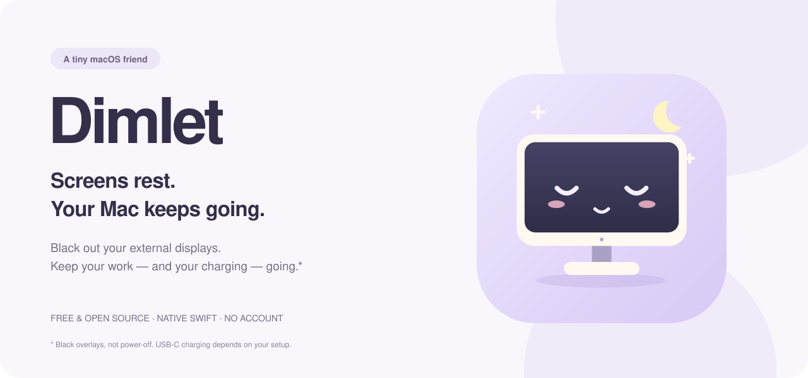

<p align="center"></p>

<p align="center">
  <a href="https://github.com/onodela2000/dimlet/releases/download/v0.3.0/Dimlet-0.3.0-macos-universal.zip"><b>macOS版をダウンロード</b></a>
  &nbsp; · &nbsp; <a href="https://onodela2000.github.io/dimlet/">公式サイト</a>
  &nbsp; · &nbsp; <a href="README.md">English</a>
</p>

**画面は暗く。Macは作業を続ける。**

Dimletは、外部モニターだけ、または内蔵画面も含めたすべてのモニターを黒表示にする、小さなメニューバーアプリです。AIエージェント、動画の書き出し、長いビルド。作業が終わるのを待つ間も、部屋を明るくしておく必要はありません。

- **暗くする範囲を2モードから選択。** 外部モニターだけ、または内蔵画面も含めてすべて。
- **アプリ起動中はMacの自動スリープを防止。** 黒表示をOFFにしても継続します。
- **モニターの電源と接続を維持。** モニターに電源OFF命令を送りません。
- **目を開けたモニターはOFF、眠ったモニターはON。** メニューバーに、ささやかな可愛さを。
- **Swift＋AppKit製。** 外部ライブラリ、アカウント、追跡、自動通信なし。

> 実際に電源を切るのではなく、画面を黒いウインドウで覆う仕組みです。省電力やバックライト消灯を保証するものではありません。モニター本体の電源はONにしてください。USB-C給電の継続は、モニター・ケーブル・電源の仕様にも依存します。

## 導入手順

**macOS 13以降**が必要です。配布版はApple Silicon／Intel両対応のUniversalアプリです。

1. **[Mac版アプリ（ZIP）をダウンロード](https://github.com/onodela2000/dimlet/releases/download/v0.3.0/Dimlet-0.3.0-macos-universal.zip)**。Mシリーズ／Intel共通のファイルです。ダウンロードはこれ1つで完了です。
2. ZIPを展開し、**Dimlet.app**を**アプリケーション**フォルダへ移動。
3. Dimletを開くと、メニューバーに小さなモニターが表示されます。初期状態は**OFF**です。

**初回起動について：** 現在の配布版はアドホック署名のみで、Appleの公証・Developer ID署名はありません。ダウンロードしたアプリの起動をmacOSにブロックされた場合、配布元を確認したうえで、一度起動を試してから**システム設定 → プライバシーとセキュリティ → このまま開く**を使ってください。[Apple公式の案内](https://support.apple.com/ja-jp/102445)も確認できます。Gatekeeper全体を無効にする必要はありません。ソースからのビルドも可能です。

動作にアクセシビリティ・画面収録・管理者の権限は不要です。毎回自動で起動したい場合は、**システム設定 → 一般 → ログイン項目**に任意で追加できます。Dimletが勝手に登録することはありません。

## 使い方

メニューバーのモニターをクリックし、次のどちらかを選びます。

- **外部モニターだけ暗くする**：内蔵画面はいつもどおり使えます。
- **すべてのモニターを暗くする（内蔵＋外部）**：MacBookの画面も含めて、すべて黒表示にします。

有効なモードにチェックが付きます。同じ項目をもう一度選ぶとOFF、別の項目を選ぶとモードが切り替わります。**黒い画面のどこかをクリックすれば、内蔵画面も含めてすべて元に戻ります。** アプリはメニューバーに残ります。選んだモードは保存されますが、通常の起動時は必ず黒表示OFFで始まります。

| 状態 | 外部モニター | 内蔵画面 | Macの自動スリープ |
| --- | --- | --- | --- |
| OFF | 通常表示 | 通常表示 | 防止 |
| 外部モニターだけ | 黒表示（独立した画面） | 通常表示 | 防止 |
| すべてのモニター | 黒表示 | 黒表示 | 防止 |
| 終了 | 通常表示 | 通常表示 | Dimletによる防止を解除 |

ON中に接続した画面も、有効なモードに従って対象になります。

**言語の変更：** メニューの **Language** から **English／日本語／简体中文／Français／Deutsch** を選べます。初期言語はmacOSの設定にかかわらず英語です。選択はすぐに反映され、再起動後も保存されます。中国語は簡体字に対応しています。別の言語に切り替えた後も、言語メニューには「Language」を併記するので元に戻せます。

ON中は画面の自動スリープも防ぎ、モニターとの接続を維持します。バックグラウンド作業が終わったら、メニューから**「Dimletを終了」**するとスリープ防止も解除されます。

## できること・できないこと

- **外部モニターだけ**では、内蔵画面を保護するためミラーリング中の画面を除外します。**すべてのモニター**では、ミラーリングを含むすべての表示領域が対象です。
- Mac miniなどでは、すべての独立した画面が外部画面になります。黒画面をクリックすれば戻せます。
- **MacBookのフタは開けたままに。** フタを閉じたときや手動スリープ、電源OFF、バッテリー切れは防ぎません。
- AIアプリそのものの停止、ネットワーク切断、ジョブの失敗までは防ぎません。
- 黒表示はプライバシーロックではありません。LCDではバックライトの光が少し残る場合があります。
- 終了時に解除するのはDimlet自身のスリープ防止だけです。ほかのアプリの設定は変更しません。

## 作ったきっかけ

USB-Cモニターの電源を切ったら、Macへの充電まで止まってしまった。でも、AIを動かしている間はMacをスリープさせたくない。そこで、接続を保ったまま外部画面だけを黒くするDimletを作りました。

MacBook Air M4＋INNOCN GA32V1Mの構成で、黒表示中も充電が続くことを確認しています。すべてのモニターの動作を保証するものではありません。DimletはDDC/CI・DSC・ファームウェア・解像度の設定を変更しません。

## ソースからビルド

Swift 5.9以降を含むXcode Command Line Tools、またはXcodeが必要です。

```bash
git clone https://github.com/onodela2000/dimlet.git
cd dimlet
swift test
./scripts/build.sh
open dist/Dimlet.app
```

Universal版は`./scripts/build.sh --universal`でビルドします。`dist/`にアプリ、ZIP、SHA-256チェックサムが生成されます。自動インストールは行いません。

実機テストはApple Silicon／macOS 26.3.1で実施しています。Intelや以前のmacOSでの実機検証は、今後の協力を歓迎します。テストの詳細は[英語README](README.md#build-it-yourself)を参照してください。

## 公式サイトの更新

[日本語LP](https://onodela2000.github.io/dimlet/ja/)と[USB-C充電の解説](https://onodela2000.github.io/dimlet/ja/mac-usb-c-monitor-charging-screen-off/)を公開しています。5言語それぞれにURLがあり、JavaScriptを実行しなくても本文を読めます。

編集元は`website/index.template.html`、`website/locales.json`、`website/charging-guide.html`です。編集後に`python3 scripts/build_site.py`で生成し、`python3 scripts/build_site.py --check`でリンク・メタ情報・生成物を確認します。生成した`site/`もコミットしてください。プレビューは`python3 -m http.server 8765 --directory site`で起動できます。CSSとデモのJavaScriptは`site/`にあり、変更後も再生成してください。`main`へ反映するとGitHub Pagesに自動公開されます。

各言語のcanonical・hreflangと`sitemap.xml`を生成します。検索掲載の確認には、所有者のGoogle Search ConsoleでURLプレフィックス`https://onodela2000.github.io/dimlet/`を登録し、`sitemap.xml`を送信できます。サイトマップは掲載や順位を保証するものではありません。

## コントリビュート

小さく使いやすいアプリにする改善を歓迎します。PRの前に`swift test`と`./scripts/build.sh`を実行してください。表示の不具合はmacOSのバージョン、Macの機種、接続方法、ミラーリングの有無を添えてIssueへ。シリアル番号などの個人情報は不要です。

ソースコードとオリジナルSVGは[MITライセンス](LICENSE)です。
